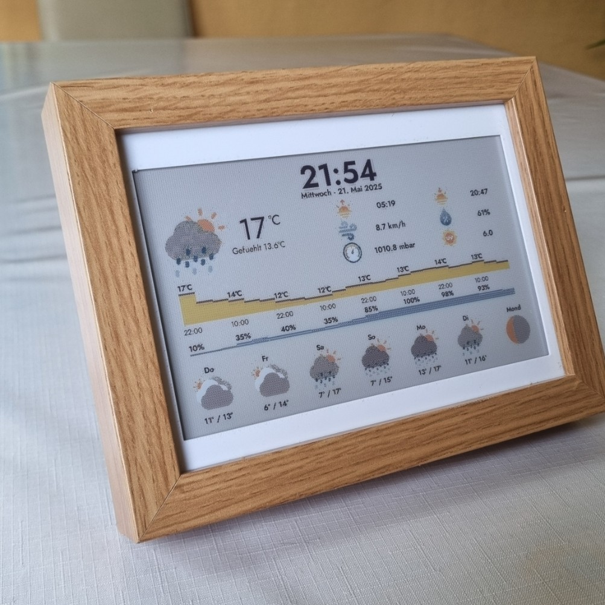
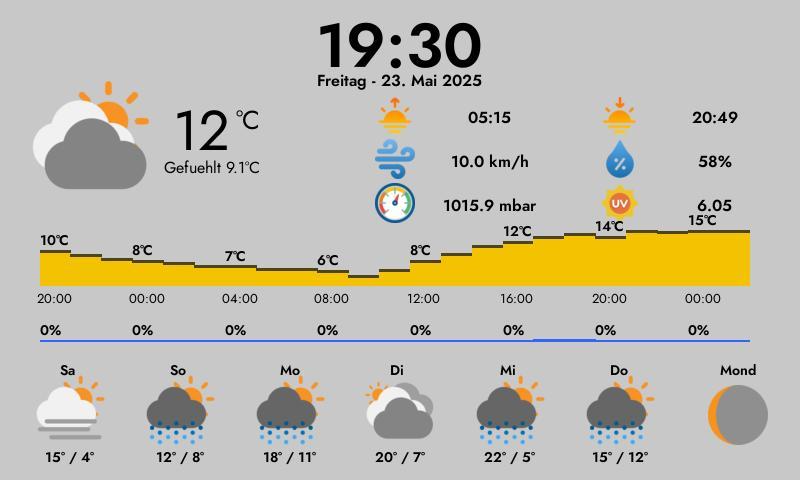

# WeatherPi_eInk

* Forked from this [WeatherPi_TFT project by LoveBootCaptain](https://github.com/LoveBootCaptain/WeatherPi_TFT).
* Inspired by [InkyPi weather plugin by fatihak](https://github.com/fatihak/InkyPi).

## Showcase



## Key differences:
* Modified to run on [Inky Frame 7.3" (Pico 2 W Aboard)](https://shop.pimoroni.com/products/inky-frame-7-3).
* Using free [Open Metro API](https://open-meteo.com/) (no account needed) instead of [weatherbit.io](weatherbit.io).
* Pico 2 W only downloads images every 5 minutes (eInk refresh time is ~40 seconds). 
Server (Python 3.13) renders (PyGame) and hosts image (Flask). 
(InkyPi project by fatihak uses Raspberry Pi to render and display images)
* 6 days of forecast.
* 24 hour precipitation and temperature forecast.

## Setup on Ubuntu Server / Raspberry Pi OS
* Copy project folder to ```/bin```
* Add A New Cron Job: ```sudo crontab -e``` and add this as last line: "@reboot python /bin/your_script.py &"
* Restart ```sudo reboot```
* (optional) Setup "Nginx Proxy Manger" to forward to a ???.duckdns.org page

## Setup Inky Frame 7.3" (Pico 2 W Aboard)
* Modify preinstalled or install [inkylauncher example](https://github.com/pimoroni/inky-frame/tree/main/examples/inkylauncher).
* Add WiFi Credentials in secrets.py
* Change ```IMG_URL = "CHANGE TO YOUR IMAGE SERVER ADDRESS"``` in nasa_apod.py

## Credits
* [LoveBootCaptain](https://github.com/LoveBootCaptain) for [WeatherPi_TFT](https://github.com/LoveBootCaptain/WeatherPi_TFT) serving as a base for this project.
* [fatihak](https://github.com/fatihak) for [InkyPi weather plugin](https://github.com/fatihak/InkyPi) inspiration.
* [Open Metro API](https://open-meteo.com) for weather api and [documentation](https://open-meteo.com/en/docs).
* Miyaichi for [moon phase rendering](https://github.com/miyaichi/WeatherPi).
